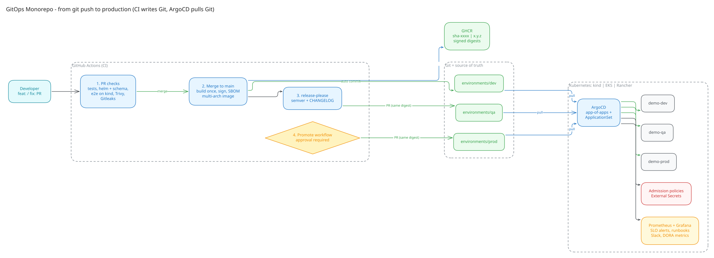
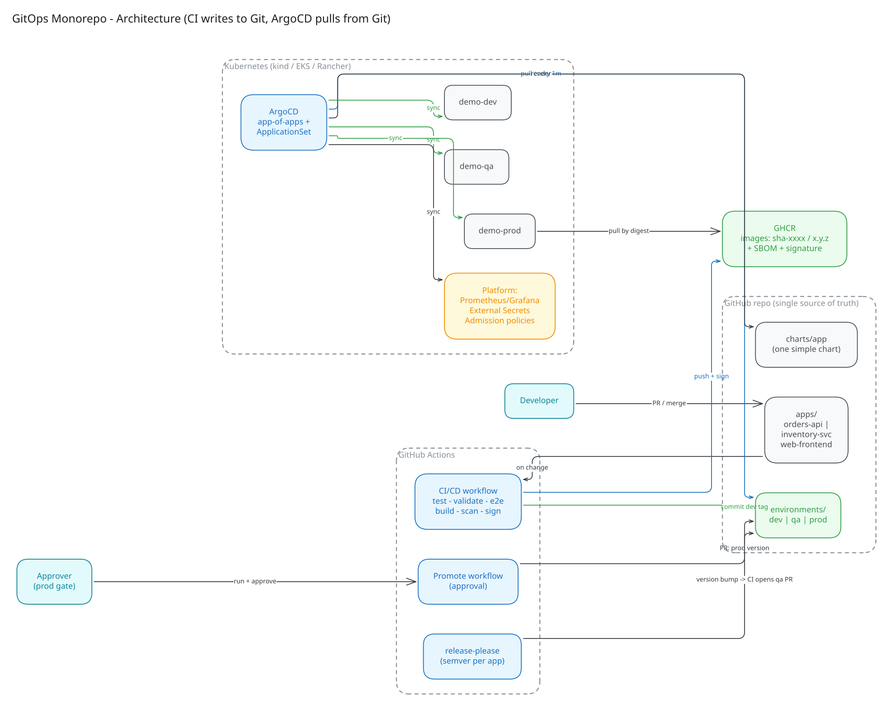
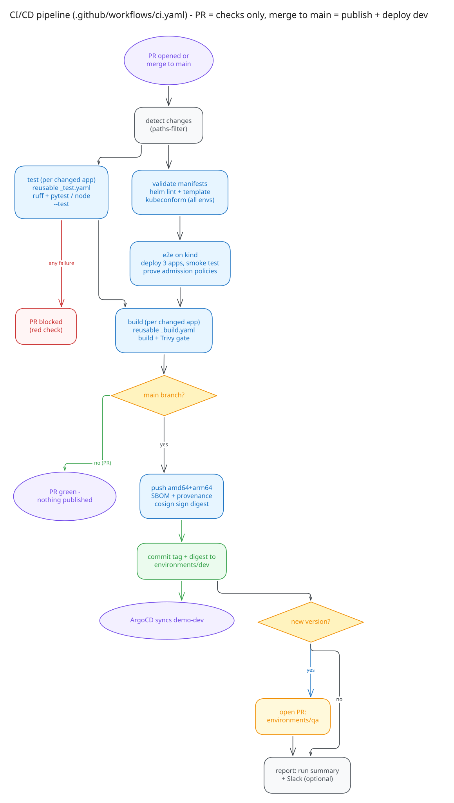
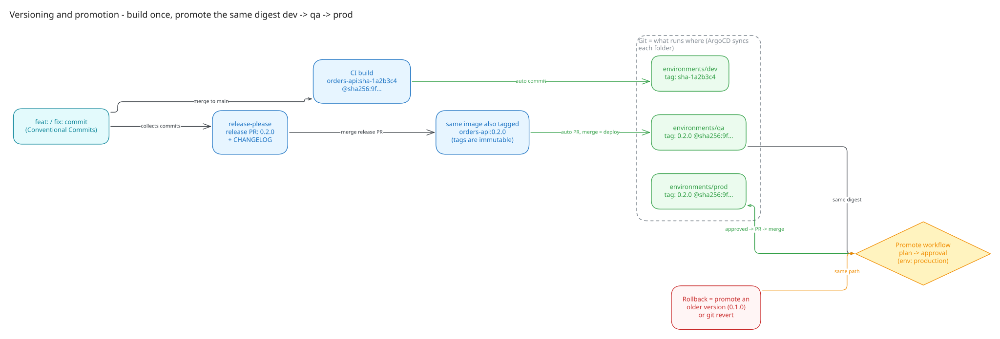
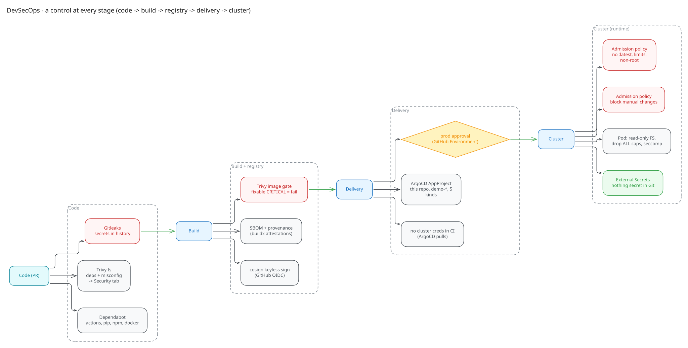
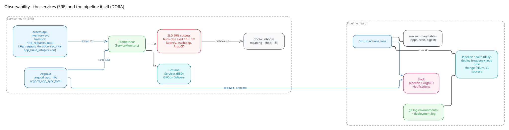

# GitOps Monorepo: `git push` → dev → qa → prod

[](https://github.com/rosaliei/gitops-monorepo/actions/workflows/ci.yaml)
[](https://github.com/rosaliei/gitops-monorepo/actions/workflows/security.yaml)
[](https://github.com/rosaliei/gitops-monorepo/actions/workflows/release-please.yaml)
[](https://github.com/rosaliei/gitops-monorepo/actions/workflows/terraform.yaml)

A working CI/CD + GitOps platform. Three services ship to three environments without anyone
running `kubectl` against the cluster. **GitHub Actions** builds, tests, scans and signs each image, **Git**
records what runs where, and **ArgoCD** makes the cluster match Git. It runs on a laptop with one
command, and on AWS EKS with Terraform.



---

## What this shows

| | |
|---|---|
| **GitOps** | ArgoCD app-of-apps + ApplicationSet · one environment folder per env · auto-sync + self-heal · CI has no cluster credentials |
| **CI/CD** | Reusable GitHub Actions workflows · monorepo path filters · e2e test on a real Kubernetes cluster for every PR |
| **Helm** | One simple chart for every service · each environment overrides only what differs |
| **Versioning & promotion** | Semver from Conventional Commits · **build once, promote the same digest** · prod approval gate · one-click rollback |
| **DevSecOps** | Trivy gate · Gitleaks · cosign signing · SBOM + provenance · admission policies that block `:latest`, root and **manual changes** |
| **SRE** | Prometheus metrics · SLO + burn-rate alerts · runbooks · Grafana dashboards · HPA · zero-downtime rollouts |
| **Pipeline monitoring** | Run summaries · Slack (pipeline + ArgoCD) · delivery dashboard · daily DORA metrics |
| **Platform** | kind locally · Terraform for EKS · works on Rancher-managed clusters · External Secrets (AWS Secrets Manager) |

## How it works: 8 steps


| | Step by step |
|---|---|
| 🖐 **Do it by hand** | [docs/manual-steps.md](docs/manual-steps.md): 16 numbered steps, from `kind create cluster` to promoting to prod |
| ⚙️ **Watch the automation** | [docs/automation-steps.md](docs/automation-steps.md): 12 numbered steps, what each pipeline does and where to see it |

## Try it in one command

```bash
git clone https://github.com/rosaliei/gitops-monorepo.git && cd gitops-monorepo
make up          # kind + ArgoCD → ArgoCD installs monitoring, secrets, policies and all apps from Git
make status      # 14 applications (root + 4 platform + 9 services) → Synced / Healthy
make ui-shop ENV=prod   # http://localhost:8081 shows which version runs in prod
```
Needs Docker, kind, kubectl and Helm. `make help` lists everything, and `make down` removes it.

## Diagrams

| | |
|---|---|
| [](docs/diagrams/2-architecture.svg) **Architecture** | [](docs/diagrams/3-cicd-pipeline.svg) **CI/CD pipeline** |
| [](docs/diagrams/4-versioning-promotion.svg) **Versioning & promotion** | [](docs/diagrams/5-security.svg) **Security** |
| [](docs/diagrams/6-observability.svg) **Observability** | Drawn in Excalidraw. Open or edit the sources in [`docs/diagrams/src`](docs/diagrams/src) at [excalidraw.com](https://excalidraw.com) |

## Repository

```
apps/            orders-api (Python) · inventory-svc (Node.js) · web-frontend (nginx)
charts/app/      one Helm chart for every service
environments/    dev/ qa/ prod/ - one values file per service; changing it = deploying
argocd/          root app-of-apps, projects, platform add-ons, ApplicationSet
platform/        admission policies, secret store, alerts, dashboards
infra/           kind cluster · Terraform for EKS
scripts/         validate · e2e · bootstrap · set-image · promote (used by hand AND by CI)
.github/         10 workflows · Dependabot
docs/            manual steps · automation steps · runbooks · interview guide · EKS & Rancher
```

## More

- [Interview guide](docs/interview-guide.md): design decisions and trade-offs, in Q&A form
- [Runbooks](docs/runbooks): what each alert means, and how to check and fix it
- [EKS & Rancher](docs/eks-and-rancher.md): the same setup on AWS or a Rancher-managed cluster

<sub>Built from a production setup I designed and ran (GitHub Actions + ArgoCD, replacing Jenkins), then improved:
environment folders instead of environment branches, build-once promotion by digest, External Secrets, and
admission policies that stop manual drift.</sub>
