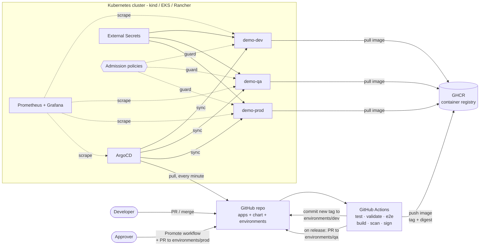
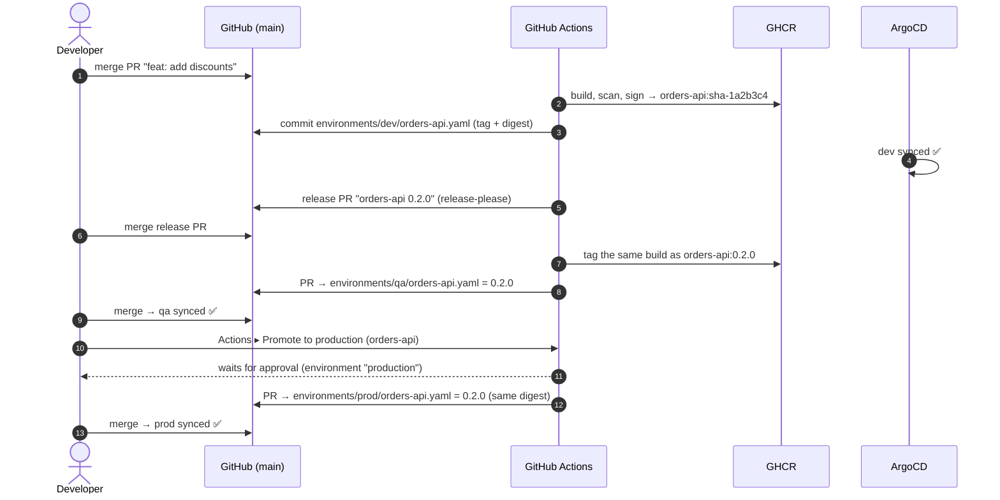

# GitOps Monorepo: CI/CD with GitHub Actions, Helm and ArgoCD

[](https://github.com/rosaliei/gitops-monorepo/actions/workflows/ci.yaml)
[](https://github.com/rosaliei/gitops-monorepo/actions/workflows/security.yaml)
[](https://github.com/rosaliei/gitops-monorepo/actions/workflows/release-please.yaml)

Three small services go from `git push` to **dev → qa → prod** without anyone running
`kubectl` against the cluster. GitHub Actions builds, tests, scans and signs each image, Git
records what runs where, and ArgoCD makes the cluster match Git. Every step can be done
**1. by hand** (to show how it works) or **2. automated** (how it runs day to day).

> **Recruiters, in 30 seconds:** this repo shows hands-on work with **Kubernetes, Helm, ArgoCD
> (GitOps), GitHub Actions (CI/CD), Docker, Terraform (AWS EKS), Prometheus/Grafana (SRE),
> and DevSecOps** (image scanning, signing, SBOM, secret scanning, admission policies).
> It all runs on a laptop with one command, and every pipeline is green.

| Area | What is in this repo |
|---|---|
| **CI** | Reusable workflows, monorepo path filters, unit tests (Python + Node), Helm and schema validation, e2e test on a kind cluster, multi-arch images |
| **CD / GitOps** | ArgoCD app-of-apps + ApplicationSet, one Helm chart for all services, environment folders, auto-sync + self-heal |
| **Versioning & promotion** | Semantic versions from Conventional Commits (release-please). Build once, then promote the same **digest** dev → qa → prod. Prod needs an approval. Rollback |
| **SRE** | Prometheus metrics in every app, SLO + burn-rate alerts, Grafana dashboards, runbooks, probes, HPA, zero-downtime rollouts |
| **Pipeline monitoring** | Run summaries, Slack notifications (pipeline + ArgoCD), delivery dashboard, daily DORA metrics |
| **DevSecOps** | Trivy (image gate + repo scan), Gitleaks, cosign keyless signing, SBOM + provenance, non-root read-only containers, admission policies, least-privilege ArgoCD projects |
| **Secrets** | External Secrets Operator. Nothing secret in Git. AWS Secrets Manager on EKS |
| **Platform** | kind locally, Terraform for EKS, notes for Rancher-managed clusters |

---

## Architecture



**Key idea:** CI never touches the cluster. It only writes to Git and the registry. ArgoCD, running
inside the cluster, pulls from Git. So the cluster needs no credentials in CI, every deployment is a
reviewed commit, and a rollback is a `git revert`.

### How a change reaches production



---

## Repository map

```
apps/                     3 sample services (each: code, unit tests, Dockerfile, version.txt)
  orders-api/             Python / FastAPI  - orders + Prometheus metrics
  inventory-svc/          Node.js           - stock + Prometheus metrics
  web-frontend/           nginx             - status page: which version runs in this environment
charts/app/               ONE simple Helm chart used by every service
environments/<env>/       dev | qa | prod - one small values file per service. Changing it = deploying
argocd/
  bootstrap/root-app.yaml the only file applied by hand (app of apps)
  apps/                   projects, platform add-ons, ApplicationSet for the services
platform/
  manifests/policies/     admission policies (built-in ValidatingAdmissionPolicy)
  manifests/secrets/      secret store for External Secrets
  manifests/monitoring/   alerts (SLO), Grafana dashboards, ArgoCD scraping
  values/                 Helm values for kube-prometheus-stack
infra/kind/               local cluster + ArgoCD install values
infra/eks/                Terraform: VPC + EKS
scripts/                  the same scripts run by hand and by CI
.github/workflows/        CI/CD, release, promote, security, pipeline health, terraform, lint
docs/                     runbooks, interview guide, EKS / Rancher
```

---

## Quick start

**Needs:** Docker, [kind](https://kind.sigs.k8s.io/), kubectl, Helm 3, Node 24 (for `make test`). About 6 GB RAM for the full platform.

### 1. By hand: the apps and the chart, no ArgoCD (5 min)

```bash
kind create cluster --name gitops-demo --config infra/kind/cluster.yaml

# build one service and give the image to the cluster (no registry needed)
docker build -t local/orders-api:0.1.0 --build-arg APP_VERSION=0.1.0 apps/orders-api
kind load docker-image local/orders-api:0.1.0 --name gitops-demo

# install it with the shared chart + the dev values
helm install orders-api charts/app -n hands-on --create-namespace \
  -f environments/dev/orders-api.yaml \
  --set image.repository=local/orders-api --set image.tag=0.1.0 --set image.digest= \
  --set image.pullPolicy=Never --set secretEnv.enabled=false --set metrics.enabled=false

kubectl -n hands-on get pods
kubectl -n hands-on port-forward svc/orders-api 8080:80 &
curl localhost:8080/api/info
```
`make hands-on` does the same for all three services.

### 2. Automation: the full GitOps platform (1 command)

```bash
make up          # kind + ArgoCD + root app → ArgoCD installs everything else from Git
make status      # watch 4 platform apps + 9 service apps (3 services × 3 envs) become Synced/Healthy
make ui-argocd   # http://localhost:8080  (password is printed by make up)
make ui-grafana  # http://localhost:3000  admin/admin → dashboards "GitOps Delivery", "Services (RED)"
make ui-shop ENV=prod   # http://localhost:8081 - the page shows what version runs in prod
```

Using a fork? Run `scripts/use-my-fork.sh <your-github-user>` first, so ArgoCD and the image names point to your repo.

---

## Walkthrough: each topic by hand, then automated

### 1. Build and test

**1. By hand**
```bash
cd apps/inventory-svc && npm ci && npm test        # Node: node:test
cd apps/orders-api && pip install -r requirements-dev.txt && pytest   # Python 3.12
docker build -t local/web-frontend:dev apps/web-frontend
```

**2. Automation:** [`ci.yaml`](.github/workflows/ci.yaml)
- `dorny/paths-filter` finds the apps that changed. Only those are tested and built (it's a monorepo).
- Tests run through the **reusable workflow** [`_test.yaml`](.github/workflows/_test.yaml), which detects Python or Node.
- `make test` runs the same checks locally.

### 2. Helm: one simple chart

**1. By hand**
```bash
helm lint charts/app -f environments/prod/orders-api.yaml
helm template orders-api charts/app -f environments/prod/orders-api.yaml   # see exactly what prod gets
diff <(helm template x charts/app -f environments/qa/orders-api.yaml) \
     <(helm template x charts/app -f environments/prod/orders-api.yaml)    # qa vs prod
```

**2. Automation:** [`scripts/validate.sh`](scripts/validate.sh), which runs on every PR (`make lint`)
- `helm lint --strict` and `helm template` for **every** environment file, plus a render with every optional feature switched on.
- `kubeconform` validates every object against the Kubernetes and CRD schemas (ArgoCD, Prometheus, External Secrets).
- The rendered manifests are uploaded as a build artifact, so reviewers can see exactly what will be deployed.

The chart ([`charts/app`](charts/app)) is intentionally small: a Deployment and a Service, plus optional HPA,
ServiceMonitor and ExternalSecret. Each environment file sets only what differs (image, replicas, env vars).

### 3. Deploy with GitOps (ArgoCD)

**1. By hand:** deploying is editing a file:
```bash
scripts/set-image.sh dev orders-api 0.1.0     # or edit environments/dev/orders-api.yaml
git commit -am "chore(dev): deploy orders-api 0.1.0" && git push
kubectl -n argocd get application orders-api-dev -w    # ArgoCD syncs within ~1 minute
```

**2. Automation:** after a merge, the `deploy-dev` job runs the same `set-image.sh` with the new
`sha-<commit>` tag and digest, then commits it. How ArgoCD is organised:
- [`root-app.yaml`](argocd/bootstrap/root-app.yaml) → [`argocd/apps/`](argocd/apps) (app of apps)
- An [ApplicationSet](argocd/apps/30-demo-apps.yaml) turns each `environments/<env>/<app>.yaml` into an Application. **Adding a service or an environment means adding a file.**
- An [AppProject](argocd/apps/00-projects.yaml) limits the services to this repo, `demo-*` namespaces and 5 resource kinds.
- Auto-sync with `prune` + `selfHeal`, retries with backoff, and sync waves (CRDs before the things that use them).

### 4. Versioning

**1. By hand**
```bash
echo "0.2.0" > apps/orders-api/version.txt     # the next version
git commit -am "feat(orders-api): add discounts" && git push
git tag orders-api-v0.2.0 && git push --tags
```

**2. Automation:** [`release-please.yaml`](.github/workflows/release-please.yaml)
- PR titles must follow **Conventional Commits** ([`pr-title.yaml`](.github/workflows/pr-title.yaml)): `fix:` → patch, `feat:` → minor, `feat!:` → major.
- release-please keeps a **release PR per app** open, with the next version and a CHANGELOG. Merging it bumps `version.txt` and creates the tag and GitHub Release.
- Image tags are **immutable**: `sha-<commit>` for every build, `x.y.z` for releases. CI never overwrites an existing tag, and nothing uses `:latest` (an admission policy rejects it).

### 5. Promotion: dev → qa → prod

**1. By hand**
```bash
scripts/promote.sh orders-api qa prod        # copies qa's tag + digest into prod's file
git checkout -b promote/orders-api && git commit -am "chore(prod): promote orders-api 0.2.0"
gh pr create --fill                           # review, merge = deploy
```

**2. Automation**
| Step | Trigger | What happens |
|---|---|---|
| → dev | every merge to main | CI commits the new `sha-` build to `environments/dev` |
| → qa | a release is merged | CI opens a PR for `environments/qa` with the release version and digest |
| → prod | **Actions ▸ Promote to production** | plan → **approval** (GitHub Environment `production`) → PR → merge = deploy |

**Build once:** qa and prod get the **same image digest** that was built and tested earlier. Nothing is rebuilt.
The chart renders `repo:tag@sha256:…`, and the promote workflow checks that the digest still matches the registry.

### 6. Rollback

**1. By hand**
```bash
git revert <commit that changed environments/prod/orders-api.yaml> && git push
# or: scripts/set-image.sh prod orders-api 0.1.0 && commit + PR
```

**2. Automation:** run **Promote to production** with `version: 0.1.0`. It detects this is a rollback,
labels it as one and follows the same approval path. The delivery metrics count it as a failed change.

### 7. Secrets

**1. By hand** (to understand the pieces)
```bash
kubectl create secret generic orders-api-secrets -n hands-on --from-literal=API_KEY=$(openssl rand -hex 16)
kubectl -n hands-on set env deploy/orders-api --from=secret/orders-api-secrets   # fine here, blocked in demo-*
kubectl -n hands-on port-forward svc/orders-api 8080:80 &
curl localhost:8080/api/info     # "secretConfigured": true (the value itself is never printed)
```

**2. Automation:** [External Secrets Operator](argocd/apps/10-external-secrets.yaml)
- The values file only names the key: `secretEnv.data.API_KEY: prod/orders-api/api-key`.
- ESO reads the secret store and writes the Kubernetes Secret. Locally the store is a clearly fake demo store. On EKS it is [AWS Secrets Manager](infra/eks/cluster-secret-store-aws.yaml), with the same store name so the apps don't change.
- GitHub Secrets hold **only what the pipeline needs**. The registry uses the built-in `GITHUB_TOKEN`, and Slack is optional. App secrets are never written into values files, because that would put them in Git history.

### 8. Security (DevSecOps)

**1. By hand**
```bash
docker run --rm -v /var/run/docker.sock:/var/run/docker.sock aquasec/trivy:0.74.0 image local/orders-api:0.1.0
docker run --rm -v "$PWD:/repo" ghcr.io/gitleaks/gitleaks:v8.30.1 git /repo --config /repo/.gitleaks.toml
kubectl -n demo-dev set image deploy/orders-api orders-api=nginx:latest   # denied by policy
cosign verify ghcr.io/rosaliei/orders-api:0.1.0 \
  --certificate-identity-regexp 'https://github.com/rosaliei/gitops-monorepo/.*' \
  --certificate-oidc-issuer https://token.actions.githubusercontent.com
```

**2. Automation**
| Layer | Control | Where |
|---|---|---|
| Code | Gitleaks on the full Git history; Trivy for vulnerable dependencies and misconfigurations → GitHub Security tab; Dependabot | [`security.yaml`](.github/workflows/security.yaml), [`dependabot.yml`](.github/dependabot.yml) |
| Image | Trivy gate (fails on fixable CRITICAL), SBOM + provenance, cosign keyless signature | [`_build.yaml`](.github/workflows/_build.yaml) |
| Runtime | non-root, read-only root filesystem, all capabilities dropped, seccomp, no service-account token | [`deployment.yaml`](charts/app/templates/deployment.yaml) |
| Cluster | admission policies: no `:latest`, memory limits required, no root or privileged containers, **no manual changes** in GitOps namespaces | [`platform/manifests/policies`](platform/manifests/policies) |
| Delivery | least-privilege AppProject, approval for prod, workflow tokens with minimal `permissions:` | [`00-projects.yaml`](argocd/apps/00-projects.yaml) |

The e2e test **proves** the policies on every PR: a manual `kubectl set image` and a `:latest` image
are both rejected, and every real environment file passes.

### 9. Observability and SLOs (SRE)

**1. By hand**
```bash
kubectl -n demo-dev port-forward svc/orders-api 8080:80 &
curl -s localhost:8080/metrics | grep -E 'http_requests_total|app_build_info'
kubectl -n monitoring port-forward svc/monitoring-kube-prometheus-prometheus 9090 &
# PromQL:  sum by (namespace, job) (rate(http_requests_total[5m]))
```

**2. Automation**
- Each app exposes RED metrics (requests, errors, duration) and `app_build_info{version,commit}`. The chart creates a ServiceMonitor.
- **SLO:** 99% of requests succeed over 30 days. **Multi-window burn-rate alert** (1h and 5m at 14.4x), plus latency, crash-loop and ArgoCD alerts. [alerts.yaml](platform/manifests/monitoring/alerts.yaml)
- Every alert links to a [runbook](docs/runbooks) that covers what it means, how to check and how to fix.
- Grafana dashboards are provisioned from Git: **Services (RED)** and **GitOps Delivery**.
- Rollouts use `maxUnavailable: 0` with readiness probes, so there's no downtime. Prod uses an HPA.

### 10. Monitoring the pipelines

**1. By hand**
```bash
gh run list --workflow ci.yaml --limit 10        # recent runs and their status
gh run view <run-id> --log-failed                 # why one failed
python3 scripts/pipeline_health.py                # DORA metrics from git history
```

**2. Automation**
| Signal | Where |
|---|---|
| Each run writes a summary table: apps, tests, e2e, scan output, image digest, what was deployed | the Actions run page |
| Pipeline result in Slack (add the `SLACK_WEBHOOK_URL` secret) | `ci.yaml` → `report` job |
| ArgoCD Notifications: *deployed*, *degraded*, *sync failed* → Slack | [`argocd-values.yaml`](infra/kind/argocd-values.yaml) |
| Sync and health of every app, **which version runs where**, syncs per day | Grafana → *GitOps Delivery* |
| **DORA**: deploy frequency per env, lead time release → prod, change failure rate, CI success rate and duration | [`pipeline-health.yaml`](.github/workflows/pipeline-health.yaml) (daily) |
| Workflow files themselves are linted (actionlint + shellcheck) | [`lint-workflows.yaml`](.github/workflows/lint-workflows.yaml) |

Because every deployment is a commit, **Git is the deployment log**: `git log environments/prod`.

### 11. Cloud: EKS and Rancher

See [docs/eks-and-rancher.md](docs/eks-and-rancher.md). Terraform for VPC + EKS is in [`infra/eks`](infra/eks)
and is checked on every PR (`fmt`, `validate`). The same ArgoCD bootstrap and the same Git files deploy to kind, EKS or a Rancher-managed cluster.

---

## Why the pipelines stay green

- **Every check runs locally first**: `make test lint e2e` runs the same scripts CI uses.
- **Pinned versions** for tools, charts, base images and actions. Dependabot proposes updates as PRs, which go through the same checks.
- **The e2e test runs on every PR**, so a broken chart, image or policy fails the PR, not the deploy.
- **Retries where needed**: the dev deploy commit rebases and retries if two pipelines finish at once.
- **Gates vs. reports**: fixable CRITICAL CVEs and leaked secrets fail the build. HIGH findings and misconfigurations are reported to the Security tab without blocking.

## One-time GitHub setup (for a fork)

1. **Settings → Actions → General → Workflow permissions:** *Read and write*, and tick *Allow GitHub Actions to create and approve pull requests* (needed for release-please and promotion PRs).
2. **Settings → Environments → New environment `production`:** add yourself as a *Required reviewer*.
3. After the first pipeline run: **Packages → each image → Package settings → visibility: Public**, so any cluster can pull without credentials.
4. Optional: a repository secret `SLACK_WEBHOOK_URL`.

---

## Background: why it is built this way

This setup is based on a production pipeline I built and ran: GitHub Actions + ArgoCD, replacing
Jenkins, with a separate GitOps config repo and branch-based environments. This version keeps what worked
and changes what hurt:

| In production | Here | Why |
|---|---|---|
| Jenkins → GitHub Actions + reusable workflows in a central repo | Reusable workflows (`_test`, `_build`) in the same repo | Kept self-contained. The pattern is the same: `uses: org/ci-workflows/...@v1` |
| Environment per branch (`feature_stabilize`, `feature_main`, `release`) | Environment per **folder** on one branch | No drift between branches. Promotion is a one-line diff |
| New image built per branch | **Build once**, promote the digest | Prod runs exactly what qa tested |
| All app config, including credentials, set as values | Plain config in values files, credentials through External Secrets | Nothing secret in Git; rotating a secret needs no deploy |
| Manual changes through Rancher weren't reverted by self-heal | Built-in admission policy blocks them | Git stays the only way in |

More design discussion: **[docs/interview-guide.md](docs/interview-guide.md)**
