# GitOps: `git push` → dev → qa → prod

[](https://github.com/rosaliei/gitops-monorepo/actions/workflows/ci.yaml)
[](https://github.com/rosaliei/gitops-apps/actions/workflows/ci.yaml)
[](https://github.com/rosaliei/gitops-monorepo/actions/workflows/security.yaml)
[](https://github.com/rosaliei/gitops-apps/actions/workflows/release-please.yaml)
[](https://github.com/rosaliei/gitops-monorepo/actions/workflows/terraform.yaml)

A working CI/CD + GitOps platform. Three services ship to three environments without anyone
running `kubectl` against the cluster. **GitHub Actions** builds, tests, scans and signs each image, **Git**
records what runs where, and **ArgoCD** makes the cluster match Git. It runs on a laptop with one
command, and on AWS EKS with Terraform.

> **New here? → [Start here](docs/start-here.md)**: the whole project in 1 picture, 3 rules, 6 files, and 7 hands-on exercises.

## Two repos, two teams

Like in most companies, **application code** and **deployment config** live in separate repos owned by separate teams:

| | [**gitops-apps**](https://github.com/rosaliei/gitops-apps): the **app repo** | **gitops-monorepo** (this repo): the **GitOps repo** |
|---|---|---|
| **Owned by** | developers | devops / platform team ([CODEOWNERS](.github/CODEOWNERS)) |
| **Contains** | `orders-api` (Python), `inventory-svc` (Node.js), `web-frontend` (nginx): code, tests, Dockerfiles, versions | the shared **Helm chart**, `environments/dev\|qa\|prod`, ArgoCD apps, platform add-ons (monitoring, policies, secrets), Terraform, scripts |
| **Pipeline** | [`ci.yaml`](https://github.com/rosaliei/gitops-apps/blob/main/.github/workflows/ci.yaml): test → e2e → build + sign image → **commit the new tag into this repo's `environments/dev`** | [`ci.yaml`](.github/workflows/ci.yaml): helm lint, schema + alert-rule checks, e2e · [`promote.yaml`](.github/workflows/promote.yaml): prod with approval |
| **ArgoCD reads it?** | **no**: the cluster never looks at app code | **yes**: the only repo ArgoCD watches |

The only bridge between the two is a **Git commit**: the app pipeline writes an image tag into this repo (with a
write-only **deploy key**), and ArgoCD does the rest.

[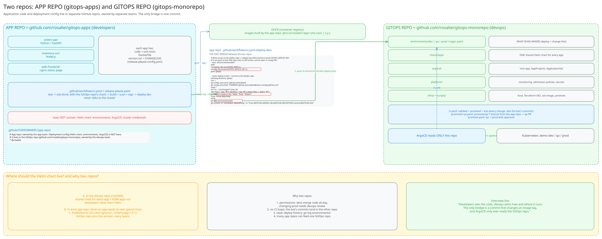](docs/diagrams/12-two-repos.svg)

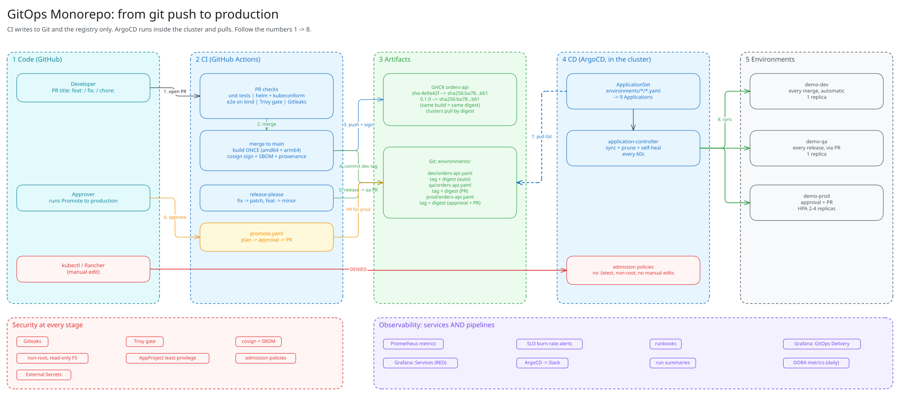

---

## What this shows

| | |
|---|---|
| **GitOps** | ArgoCD app-of-apps + ApplicationSet · one environment folder per env · auto-sync + self-heal · CI has no cluster credentials |
| **CI/CD** | App repo + GitOps repo, bridged by a deploy-key commit · reusable workflows · path filters (only changed apps build) · e2e on a real Kubernetes cluster for every PR, in both repos |
| **Helm** | One simple chart for every service · each environment overrides only what differs |
| **Versioning & promotion** | Semver from Conventional Commits · **build once, promote the same digest** · prod approval gate · one-click rollback |
| **DevSecOps** | Trivy gate · Gitleaks · cosign signing · SBOM + provenance · admission policies that block `:latest`, root and **manual changes** |
| **SRE** | Prometheus metrics · SLO + burn-rate alerts · runbooks · Grafana dashboards · HPA · zero-downtime rollouts |
| **Pipeline monitoring** | Run summaries · Slack (pipeline + ArgoCD) · delivery dashboard · daily DORA metrics |
| **Platform** | kind locally · Terraform for EKS · works on Rancher-managed clusters · External Secrets (AWS Secrets Manager) |

## See it running

Real ArgoCD UI on the local cluster after `make up`: 14 applications (root + 4 platform add-ons + 3 services × 3 environments), all **Synced** and **Healthy**.

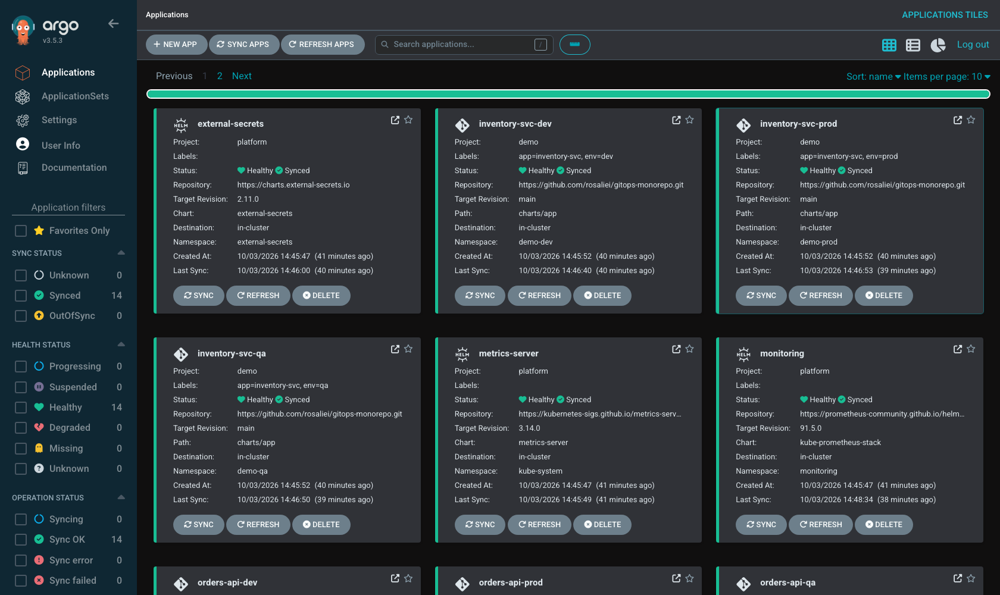

The app-of-apps in the UI: `root` creates the platform apps, the two AppProjects and the `demo-apps` ApplicationSet, which fans out to the 9 service apps (compare with the [architecture diagram](docs/diagrams/4-architecture.svg)).

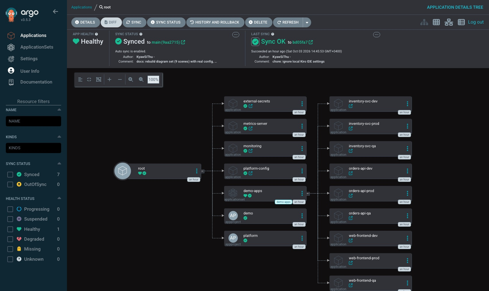

## How it works: 8 steps

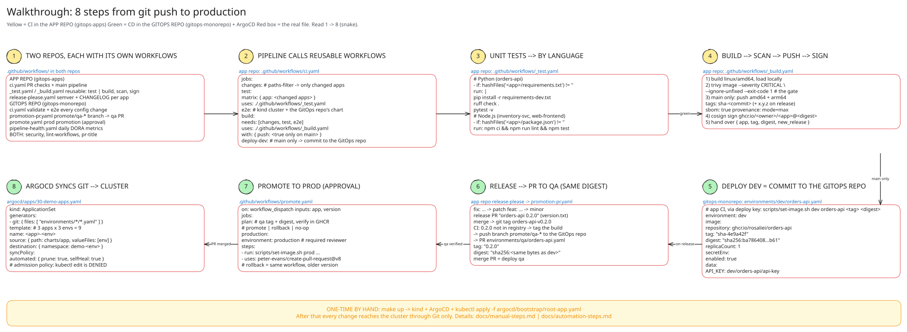

| | Step by step |
|---|---|
| 🖐 **Do it by hand** | [docs/manual-steps.md](docs/manual-steps.md): 16 numbered steps, from `kind create cluster` to promoting to prod, also as a [visual guide with terminal and UI screens](docs/diagrams/3-manual-steps.svg) |
| 📸 **See a real run** | [docs/real-run.md](docs/real-run.md): the same 16 steps performed for real, with 46 screenshots of every command and every click (release 0.2.0 shipped dev → qa → prod) |
| ⚙️ **Watch the automation** | [docs/automation-steps.md](docs/automation-steps.md): 12 numbered steps, what each pipeline does and where to see it |

## Try it in one command

```bash
git clone https://github.com/rosaliei/gitops-monorepo.git && cd gitops-monorepo
make up          # kind + ArgoCD → ArgoCD installs monitoring, secrets, policies and all apps from Git
make status      # 14 applications (root + 4 platform + 9 services) → Synced / Healthy
make ui-shop ENV=prod   # http://localhost:8081 shows which version runs in prod
```
Needs Docker, kind, kubectl and Helm. `make help` lists everything, and `make down` removes it.

## Deep dives

Each diagram uses the real files from this repo. Click to open full size.

| | |
|---|---|
| [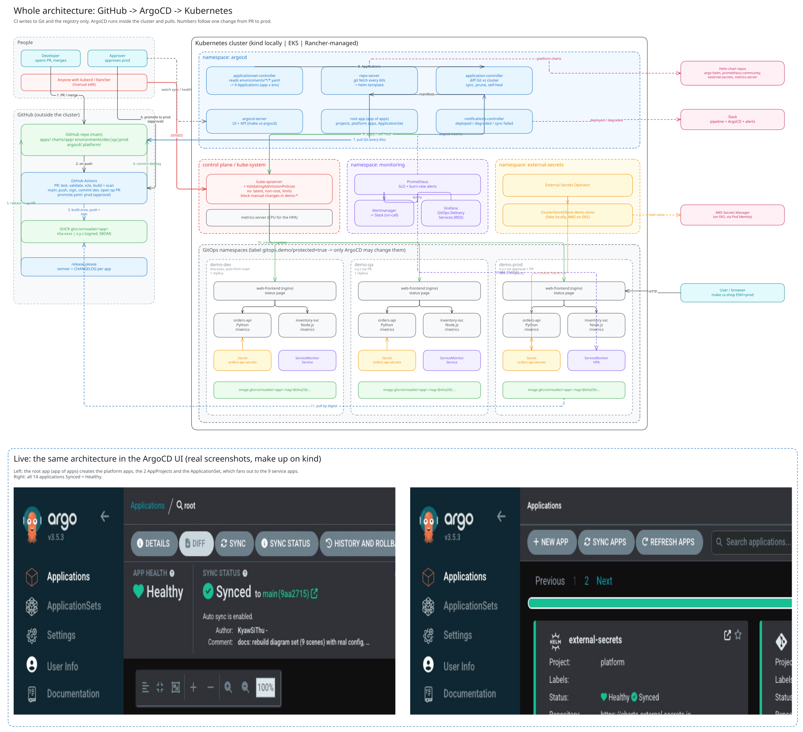](docs/diagrams/4-architecture.svg) **Architecture**: GitHub, every ArgoCD component, platform namespaces, the 3 environments | [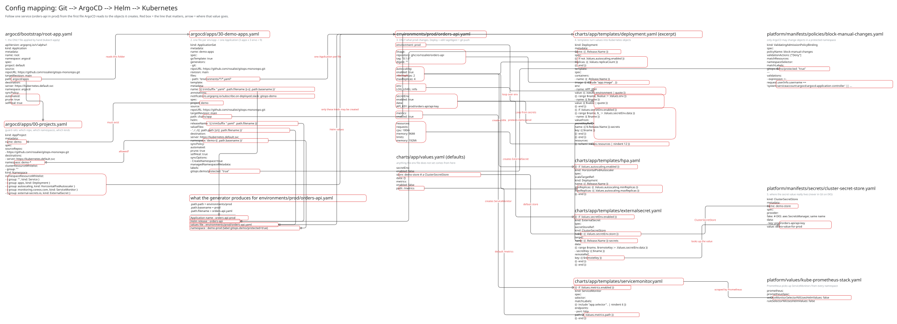](docs/diagrams/5-config-mapping.svg) **Config mapping**: line by line, `root-app` → ApplicationSet → env values → Helm templates → cluster |
| [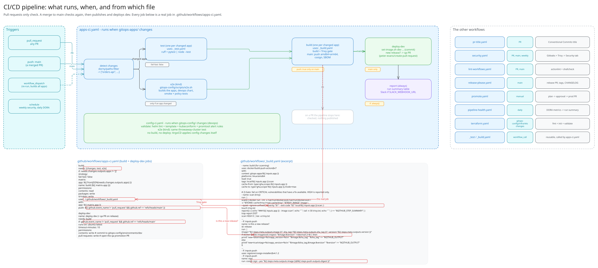](docs/diagrams/6-cicd-pipeline.svg) **CI/CD pipeline**: triggers, the real job graph, reusable workflows | [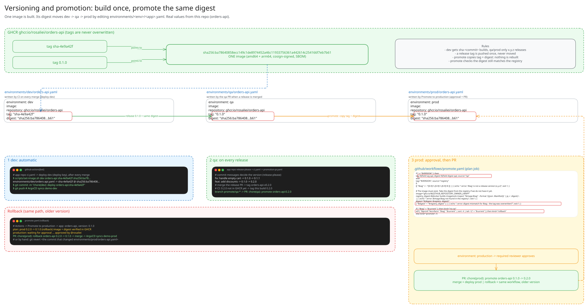](docs/diagrams/7-versioning-promotion.svg) **Versioning & promotion**: one digest moving dev → qa → prod, approval, rollback |
| [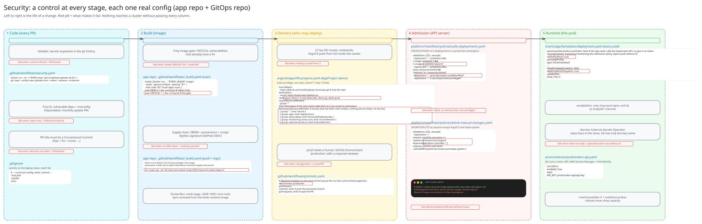](docs/diagrams/8-security.svg) **Security**: a control at every stage, with the config that enforces it | [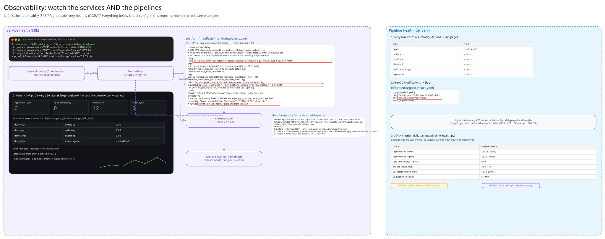](docs/diagrams/9-observability.svg) **Observability**: SLO alerts, dashboards, ArgoCD notifications, DORA |
| [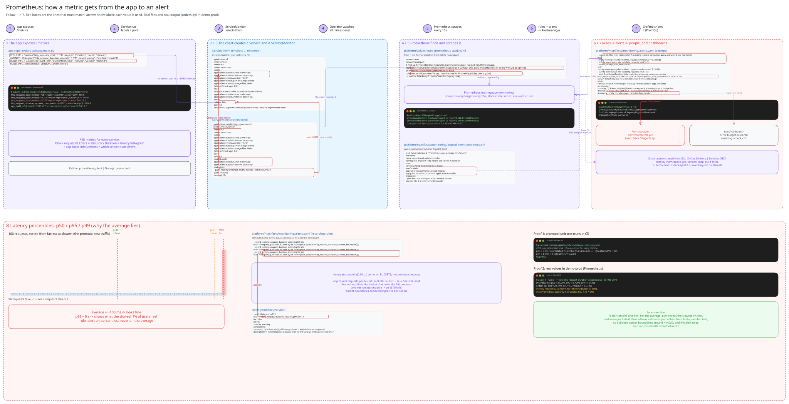](docs/diagrams/11-prometheus.svg) **Prometheus**: how a metric gets from the app to an alert: labels, ServiceMonitor, operator, rules, Alertmanager, plus **p50 / p95 / p99** explained | [](docs/diagrams/12-two-repos.svg) **Two repos**: who owns the app repo vs the GitOps repo, which pipeline runs in each, and the one commit that bridges them |

Drawn in Excalidraw. Open or edit the sources from [`docs/diagrams/src`](docs/diagrams/src) at [excalidraw.com](https://excalidraw.com).

## Repository

```
charts/app/          one Helm chart for every service
environments/        dev/ qa/ prod/ - one values file per service; changing it = deploying
argocd/              root app-of-apps, projects, platform add-ons, ApplicationSet
platform/            admission policies, secret store, alerts, dashboards
infra/               kind cluster · Terraform for EKS
scripts/             validate · e2e · bootstrap · set-image · promote (used by hand AND by CI)
.github/             ci · promote · promotion-pr · security · terraform · ... · CODEOWNERS
docs/                start here · manual + automation steps · runbooks · interview guide
```
The application code (orders-api, inventory-svc, web-frontend) is in **[rosaliei/gitops-apps](https://github.com/rosaliei/gitops-apps)**.

## More

- [Interview guide](docs/interview-guide.md): design decisions and trade-offs, in Q&A form
- [Runbooks](docs/runbooks): what each alert means, and how to check and fix it
- [EKS & Rancher](docs/eks-and-rancher.md): the same setup on AWS or a Rancher-managed cluster

<sub>Built from a production setup I designed and ran (GitHub Actions + ArgoCD, replacing Jenkins), then improved:
environment folders instead of environment branches, build-once promotion by digest, External Secrets, and
admission policies that stop manual drift.</sub>
