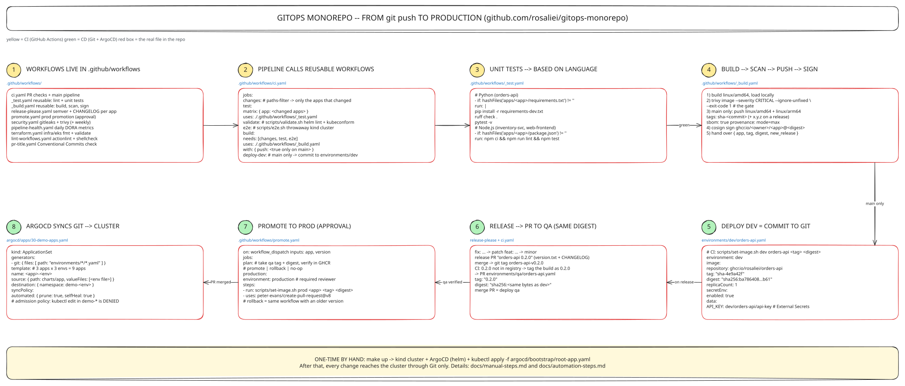

# Automation steps: what the pipelines do

The same journey as [manual-steps.md](manual-steps.md), done by GitHub Actions and ArgoCD.
The numbers match the walkthrough diagram:



| # | You do | Automation does | File |
|---|---|---|---|
| 1 | open a PR | tests, validation, e2e, build + scan | [`ci.yaml`](../.github/workflows/ci.yaml) |
| 2 | nothing | checks the PR title (Conventional Commits) | [`pr-title.yaml`](../.github/workflows/pr-title.yaml) |
| 3 | merge the PR | builds once, pushes, signs | [`_build.yaml`](../.github/workflows/_build.yaml) |
| 4 | nothing | deploys to **dev** by committing to Git | `ci.yaml` → `deploy-dev` |
| 5 | merge the release PR | versions the app, opens the **qa** PR | [`release-please.yaml`](../.github/workflows/release-please.yaml) |
| 6 | merge the qa PR | ArgoCD deploys **qa** | [`30-demo-apps.yaml`](../argocd/apps/30-demo-apps.yaml) |
| 7 | run *Promote to production*, approve, merge | opens the **prod** PR with the same digest | [`promote.yaml`](../.github/workflows/promote.yaml) |
| 8 | nothing | ArgoCD syncs, self-heals, notifies | [`argocd/`](../argocd) |
| 9 | run *Promote* with an older version | rollback through the same path | `promote.yaml` |
| 10 | read the results | pipeline monitoring + DORA metrics | [`pipeline-health.yaml`](../.github/workflows/pipeline-health.yaml) |
| 11 | nothing | weekly security scans, dependency PRs | [`security.yaml`](../.github/workflows/security.yaml), [`dependabot.yml`](../.github/dependabot.yml) |
| 12 | change `infra/eks` | Terraform fmt + validate | [`terraform.yaml`](../.github/workflows/terraform.yaml) |

---

## 1. Open a pull request → PR checks
**Trigger:** any PR. **Workflow:** `ci.yaml` (plus `security.yaml`, `lint-workflows.yaml` when relevant)

| Job | What it does | Fails when |
|---|---|---|
| detect changes | `dorny/paths-filter` → list of changed apps | - |
| test (per app) | reusable [`_test.yaml`](../.github/workflows/_test.yaml): ruff + pytest, or node --test | a test fails |
| validate manifests | [`scripts/validate.sh`](../scripts/validate.sh): helm lint + template for every env + kubeconform | a chart or ArgoCD file is invalid |
| e2e (kind) | [`scripts/e2e.sh`](../scripts/e2e.sh): real cluster, 3 apps, smoke test, policy tests | anything doesn't start, or a policy doesn't block |
| build (per app) | build + Trivy gate, **nothing is published** | fixable CRITICAL CVE |
| gitleaks / trivy | secrets in history; dependency + misconfig report | a secret is found |

**You see:** green checks on the PR, and the rendered manifests as a downloadable artifact.

## 2. PR title check
`feat: …` / `fix: …` / `chore: …` are required, because with squash-merge the title becomes the commit
message, and step 5 turns it into a version number.

## 3. Merge → build once, push, sign
The same checks run again, then for each changed app:
1. multi-arch image (`linux/amd64`, `linux/arm64`) → `ghcr.io/rosaliei/<app>:sha-<commit>`
2. SBOM + provenance attestations
3. keyless **cosign** signature on the digest
4. if `apps/<app>/version.txt` holds a version that is not in the registry yet, the **same build** is also tagged `x.y.z`

**You see:** a summary table on the run: app, tag, release, digest, and the Trivy output.

## 4. Deploy to dev (automatic)
The `deploy-dev` job runs `scripts/set-image.sh dev <app> <tag> <digest>` and commits:
```
chore(dev): deploy orders-api:sha-4e9a42f
```
ArgoCD sees the commit and syncs `demo-dev` within a minute. **CI never talks to the cluster.**

## 5. Release (release-please)
release-please keeps a **release PR** open with the next version and CHANGELOG for each app
(`fix` → patch, `feat` → minor). Merging it tags `orders-api-v0.2.0` and bumps `version.txt`.
Step 3 then publishes `0.2.0` and opens a PR for qa:
```
chore(qa): promote orders-api:0.2.0      environments/qa/orders-api.yaml  tag + digest
```

## 6. Merge the qa PR → qa deploys
ArgoCD syncs `demo-qa`. qa now runs **the exact digest that dev tested**.

## 7. Promote to production (approval)
**Actions → Promote to production → Run workflow** (app, version empty):
1. `plan` reads qa's tag + digest, checks the image exists in GHCR and the digest matches
2. `production` job **waits for a required reviewer** (GitHub Environment `production`)
3. it opens `chore(prod): promote orders-api 0.1.0 -> 0.2.0` → merging it = the deploy

## 8. ArgoCD keeps the cluster equal to Git
- one **ApplicationSet** → 9 Applications (3 apps × 3 envs), auto-sync with `prune` + `selfHeal`
- **admission policies** reject `:latest`, root containers and missing limits, and block manual edits in `demo-*`
- **ArgoCD Notifications** → Slack: *deployed*, *degraded*, *sync failed*

## 9. Rollback
Run *Promote to production* with `version: 0.1.0`. The plan labels it `rollback`, and it takes the
same approval → PR → merge path. The DORA report counts it as a failed change.

## 10. Monitoring the pipelines
| Signal | Where |
|---|---|
| per-run summary tables (apps, tests, e2e, digest, scan, deploy) | each Actions run |
| pipeline result → Slack (secret `SLACK_WEBHOOK_URL`) | `ci.yaml` → `report` |
| deploy events → Slack | ArgoCD Notifications |
| **what version runs where**, sync/health, syncs per day | Grafana → *GitOps Delivery* |
| deploy frequency, lead time, change failure rate, CI success rate | *Pipeline health* workflow (daily) |

## 11. Security on autopilot
- weekly Gitleaks + Trivy scans, even when no code changed (new CVEs appear anyway)
- Dependabot PRs for pip, npm, actions, base images, all going through step 1
- workflows linted with actionlint + shellcheck

## 12. Infrastructure
Changes to `infra/eks` run `terraform fmt -check`, `init` and `validate`. `apply` is a deliberate,
reviewed step. See [eks-and-rancher.md](eks-and-rancher.md).
