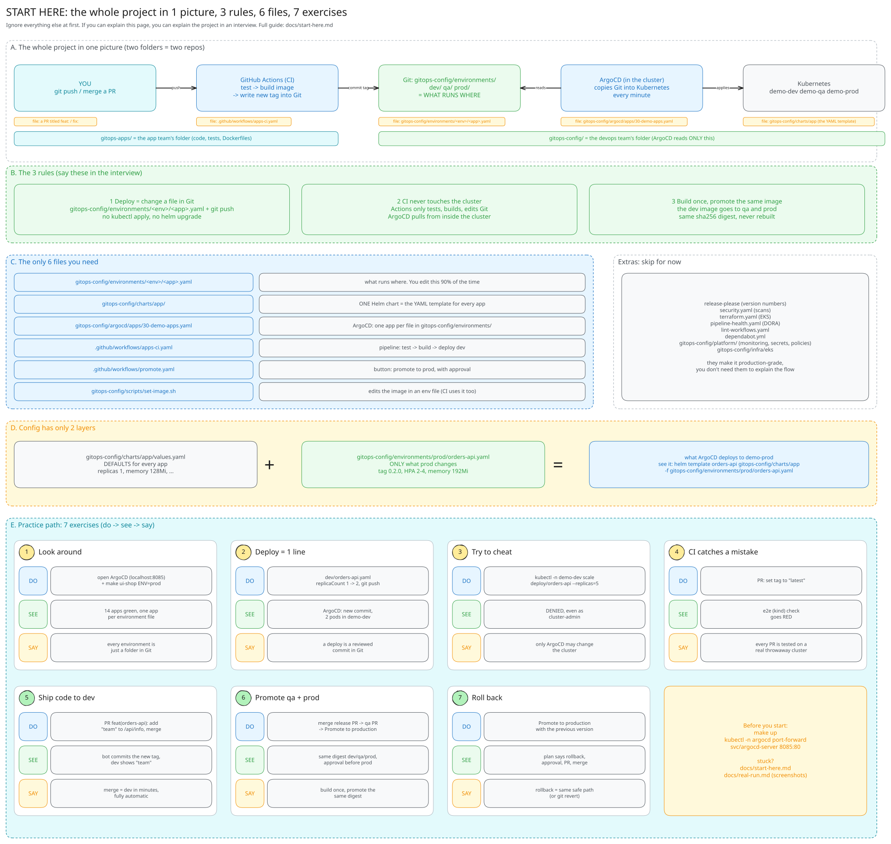

# Start here: the simple version

This repo has a lot of files, but you only need **3 rules**, **6 files** and **one picture** to
understand it. Everything else is an extra you can learn later.



## The picture

```
   APP REPO: gitops-apps (developers)                  GITOPS REPO: this repo (devops)
 ┌────────────────────────────────┐                  ┌─────────────────────────────────┐
 │ you: git push / merge a PR     │                  │ environments/dev/<app>.yaml     │◄── ArgoCD reads ONLY this
 │ ci.yaml:                       │  commits the new │ environments/qa/   (PR)         │    repo and copies it
 │   test -> build image ─────────┼── image tag ────►│ environments/prod/ (approval)   │    into the cluster
 └────────────────────────────────┘  (deploy key)    │ charts/app  argocd/  platform/  │        │
                                                     └─────────────────────────────────┘        ▼
                                                                        Kubernetes: demo-dev  demo-qa  demo-prod
```

Two repos, two teams: developers own the **app repo** ([rosaliei/gitops-apps](https://github.com/rosaliei/gitops-apps)),
devops owns the **GitOps repo** (this one). The only bridge between them is a Git commit that changes an image tag
([diagram](diagrams/12-two-repos.svg)).

## The 3 rules (say these in an interview)

1. **Deploying = changing a file in Git.** `environments/<env>/<app>.yaml` says which image runs where.
   Change the file, push it, and ArgoCD makes the cluster match. No `kubectl apply`, no `helm upgrade`.
2. **CI never touches the cluster.** GitHub Actions only tests, builds the image and edits Git.
   ArgoCD runs *inside* the cluster and pulls. So CI holds no cluster passwords.
3. **Build once, promote the same image.** The image built for dev is the exact image that goes to qa
   and prod (same `sha256` digest). Nothing is rebuilt between environments.

## The only 6 files you need

| File | What it is | You change it when... |
|---|---|---|
| `environments/<env>/<app>.yaml` | **What runs where**: image tag, replicas, env vars | you deploy or change config (**90% of the time**) |
| `charts/app/` | One Helm chart = the Kubernetes YAML template for every app | you need a new kind of setting |
| `argocd/apps/30-demo-apps.yaml` | Tells ArgoCD "one app per file in `environments/`" | almost never |
| [`ci.yaml` in the app repo](https://github.com/rosaliei/gitops-apps/blob/main/.github/workflows/ci.yaml) | The app pipeline: test → build → **write the new tag into this repo** | you change how CI works |
| `.github/workflows/promote.yaml` | Button to promote to prod, with approval | almost never |
| `scripts/set-image.sh` | Edits the image in an environment file (CI uses it too) | you deploy by hand |

**Extras, skip for now:** this repo's `ci.yaml` (checks every config change), `release-please` in the app repo (version numbers), `promotion-pr.yaml`, `security.yaml`, `terraform.yaml`,
`pipeline-health.yaml`, `lint-workflows.yaml`, `dependabot.yml`, `platform/` (monitoring, secrets,
policies), `infra/eks`. They make the project production-grade, but you don't need them to understand the flow.

## How config is layered (only 2 layers)

```
charts/app/values.yaml            defaults for every app           (replicas: 1, memory: 128Mi, ...)
        +
environments/prod/orders-api.yaml only what prod changes            (tag 0.2.0, HPA 2-4, memory 192Mi)
        =
what ArgoCD deploys to demo-prod
```
See it yourself: `helm template orders-api charts/app -f environments/prod/orders-api.yaml`

---

# Practice path: 7 exercises

Do them in order. Each one is small and teaches one idea. Every exercise follows the same pattern:
**do → see → say**.

Before you start: `make up` (once) and keep ArgoCD open: `kubectl -n argocd port-forward svc/argocd-server 8085:80`
→ http://localhost:8085 (user `admin`, password: `kubectl -n argocd get secret argocd-initial-admin-secret -o jsonpath='{.data.password}' | base64 -d`).

### Exercise 1: Look around (5 min)
- **Do:** open ArgoCD. Click `orders-api-dev`, then `orders-api-prod`. Run `make ui-shop ENV=prod` and open http://localhost:8081.
- **See:** 14 apps, all green. Each environment is a separate app built from a separate file.
- **Say:** *"Every environment is just a folder in Git. ArgoCD keeps the cluster equal to it."*

### Exercise 2: Deploy by changing one line (10 min)
- **Do:** in `environments/dev/orders-api.yaml` change `replicaCount: 1` to `replicaCount: 2`, then
  ```bash
  git commit -am "chore(dev): scale orders-api to 2" && git push
  ```
- **See:** within about 1 minute (or click **Refresh**), ArgoCD shows the new commit and **2 pods** for orders-api in `demo-dev`.
  Prod is not touched.
- **Say:** *"A deploy is a reviewed commit. The history of every environment is `git log environments/`."*
- **Undo:** set it back to `1` and push.

### Exercise 3: Try to cheat, and get blocked (5 min)
- **Do:** `kubectl -n demo-dev scale deploy/orders-api --replicas=5`
- **See:** `denied request: Manual changes are blocked in GitOps namespaces`, even though you are cluster-admin.
- **Say:** *"Only ArgoCD may change these namespaces. Self-heal alone doesn't revert fields it doesn't own,
  for example edits made in Rancher, so I block them at the Kubernetes API."*

### Exercise 4: Let CI catch a mistake (15 min)
- **Do:** on a new branch, change `tag:` in `environments/dev/orders-api.yaml` to `"latest"`. Push and open a PR.
- **See:** the **e2e (kind)** check goes **red**: the policy rejects `:latest`. The PR can't do damage.
- **Say:** *"Every PR is tested on a real throwaway Kubernetes cluster, including the security policies."*
- **Undo:** close the PR, delete the branch.

### Exercise 5: Ship a code change to dev (15 min)
- **Do:** in the **app repo** ([gitops-apps](https://github.com/rosaliei/gitops-apps)), edit `orders-api/app/main.py`: add
  `"team": "platform",` to the `/api/info` response. Open a PR titled `feat(orders-api): show team`, wait for green checks, merge.
- **See:** the app repo's Actions build the image → the bot commits `chore(dev): deploy orders-api:sha-…` **into this repo** → ArgoCD updates dev →
  `curl localhost:8081/api/orders/info` (with `make ui-shop ENV=dev`) shows `"team"`.
- **Say:** *"Merge in the app repo = dev in a few minutes, fully automatic. The app pipeline's only power is a commit to the GitOps repo."*

### Exercise 6: Promote to qa and prod (15 min)
- **Do:** in the app repo, merge the **release PR** ("chore: release main") that release-please opened for your `feat:`.
  Its CI then pushes a `promote/qa-*` branch here, which becomes a **qa PR** in this repo. Merge it. Then **Actions → Promote to production → orders-api → Run**,
  approve, and merge the PR it opens.
- **See:** the qa and prod PRs contain the **same digest** as dev. ArgoCD updates qa, then prod.
- **Say:** *"Build once, promote the same digest. Prod needs a human approval and a PR."*

### Exercise 7: Roll back (5 min)
- **Do:** **Actions → Promote to production**, app `orders-api`, version = the previous version (e.g. `0.2.0`).
- **See:** the plan says `rollback`, it waits for approval, then opens a PR. Merge it, and prod is back on the old version.
- **Say:** *"Rollback uses the same safe path as a deploy. Or simply `git revert`."*

---

## Your 30-second interview pitch

> "It's a GitOps monorepo. GitHub Actions tests and builds each service once, then writes the new image
> into a Git folder per environment. ArgoCD, running inside the cluster, keeps Kubernetes equal to Git.
> So a deploy is a pull request, a rollback is a revert, and CI never needs cluster credentials.
> The same signed image moves dev → qa → prod, prod needs an approval, and admission policies block anyone,
> even admins, from changing the cluster by hand."

**Go deeper when they ask:** [interview guide](interview-guide.md) · [real run with screenshots](real-run.md) ·
[all diagrams](../README.md#deep-dives)
